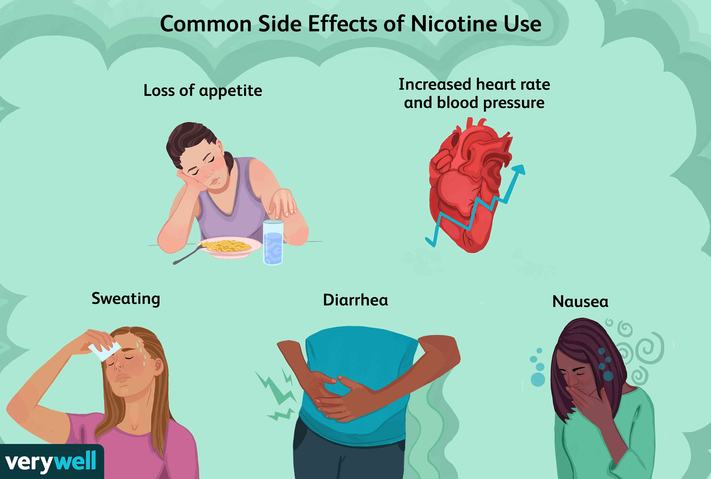

This was a final project for ESL 100. I had to choose a topic that is problematic in society and conduct extensive research about it. I decided to choose nicotine because I feel that many teenagers nowadays tend to get addicted to nicotine easily. Once people become addicted to nicotine, it is extremely challenging to quit, which can lead to serious health problems such as cancer. The main sources of nicotine are smoking and vaping, both of which cause significant health issues.

I worked on this project alone, and it took me about 24 hours to complete. It was difficult to find academic sources about nicotine that matched what I was looking for. There were too many resources that were not relevant to my needs. I had to learn about nicotine and understand it thoroughly in order to write the essay. It was not easy to comprehend the information without any prior background knowledge.

Through this process, I learned how to research a topic and write an essay about it. This was my first time writing a 10-page essay, which was a challenging task. The fact that English is not my first language made it even more difficult. I realized that reading articles and summarizing them with only the necessary information is a valuable skill. In the end, I was able to complete the essay and gain a deeper understanding of nicotine, which reinforced my resolve never to try nicotine, not even once.

Here is the link to the research essay: https://docs.google.com/document/d/1ga07zb6HviqFgG3D5RRxdiFUByXBNiNf3M9vYgareeQ/edit?usp=sharing
