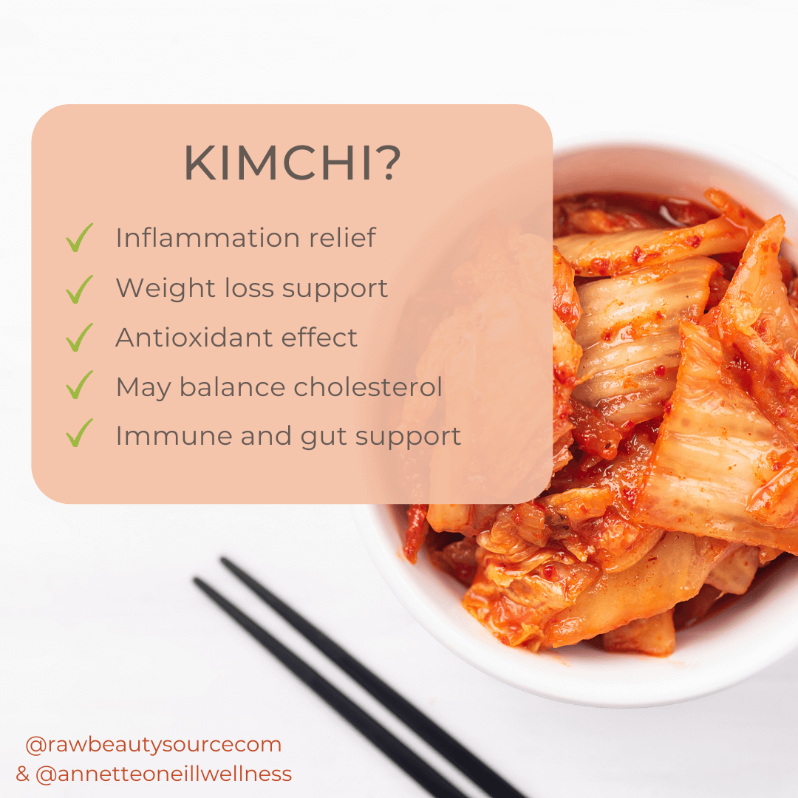

This was my final project for the FSHN 185 class. It is called the Kupuna Project because "Kupuna" means "elder" in Hawaiian. For this project, we had to choose one traditional food from our home country and research it. I chose Kimchi, the most well-known Korean food. However, a fun fact about me is that I don’t enjoy eating Kimchi as much as most other Koreans.

I worked on this project by myself, and it took me about 24 hours to complete. The most challenging part was conducting the interview, as I had to prepare the entire script. Additionally, my mother was in Korea, so we had to coordinate the timing and conduct the interview over Zoom while recording the audio. I also decided to create a slide presentation about the interview. Using visual representations is essential to keep the audience engaged.

During this project, I learned how to create a website using Google Sites. Initially, I thought publishing a website would be very complicated, but I discovered that it can be done quite easily with Google Sites. Moreover, I gained a deeper understanding of my country’s traditional food, Kimchi. Even though I was born and raised in Korea for most of my life, I didn’t know many details about this food before. In conclusion, I learned that Kimchi is not only a very healthy food but also one that is becoming increasingly popular in Hawaii!

Here is the link to the website: https://sites.google.com/hawaii.edu/sungwonhan?usp=sharing
